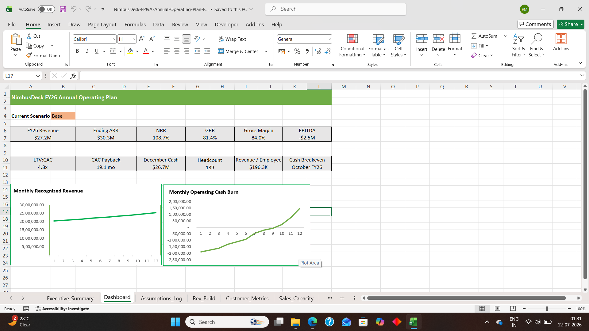

# NimbusDesk FP&A Annual Operating Plan (FY26)

## Overview

This project demonstrates an end-to-end Financial Planning & Analysis (FP&A) model developed for a SaaS business. The model integrates budgeting, forecasting, scenario planning, variance analysis, executive reporting and a three-statement financial model to support management decision-making.

---

## Business Objective

Develop an Annual Operating Plan (AOP) for FY26 that enables management to:

- Forecast revenue growth
- Plan departmental expenses
- Build hiring plans
- Forecast cash flow
- Analyze profitability
- Evaluate multiple business scenarios
- Monitor Budget vs Actual performance

---

## Model Structure

- Executive Summary
- Board Dashboard
- Assumptions
- Revenue Build
- Customer Metrics
- Sales Capacity Planning
- Headcount Planning
- Department Budget
- Operating Expense Budget
- Cash Flow Forecast
- Three Statement Financial Model
- Scenario Planning
- Variance Analysis

---

## Key KPIs

- FY26 Revenue
- Ending ARR
- Net Revenue Retention (NRR)
- Gross Revenue Retention (GRR)
- Gross Margin
- EBITDA
- LTV : CAC
- CAC Payback
- Cash Breakeven
- Revenue per Employee

---

## Financial Planning Features

- Driver-Based Revenue Forecasting
- SaaS ARR Bridge
- Department Budgeting
- Headcount Planning
- Scenario Analysis (Base / Upside / Downside)
- Budget vs Actual Variance Analysis
- Executive Dashboard
- Integrated Three Statement Financial Model

---

## Tools Used

- Microsoft Excel
- Financial Modeling
- FP&A
- Budgeting
- Forecasting
- Scenario Analysis
- Executive Reporting

---

## Dashboard Preview

---

## Author

Radhika Mahalle
